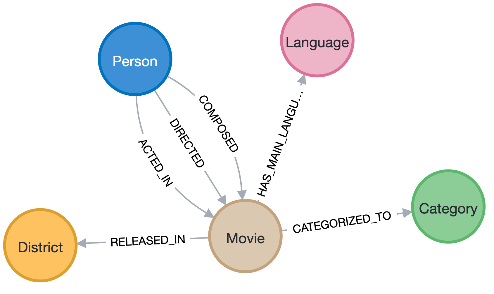
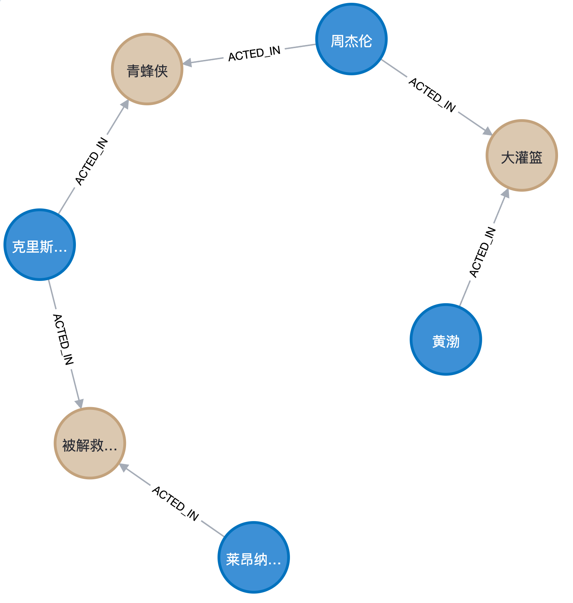

# 使用Neo4j为豆瓣电影构建电影知识图谱

使用Neo4j将豆瓣电影原始数据构建为知识图谱，可以方便地实现最短路劲、多跳查询等传统关系型数据库并不擅长的操作，此外还有一些列其他的好处。

原始数据来源：http://data.openkg.cn/dataset/douban-movie-kg

## 构建过程

构建过程已发布在微信公众号上，欢迎大家阅读。

地址：[使用Neo4j构建豆瓣电影知识图谱](https://mp.weixin.qq.com/s?__biz=MjM5NTQ3NTg4MQ==&mid=2257496750&idx=1&sn=bae5302dd4d7e9ac2e43acde312e750f&chksm=a58df26892fa7b7e0d03c0ef40599ae1ae74cc26e0263d65f499dbec5752e59f6a58e9d7aafb&token=1417580679&lang=zh_CN#rd)

## 效果展示

### Schema

共构建了5中节点，6种关系，Schema如下：

### 查询效果

最短路径

